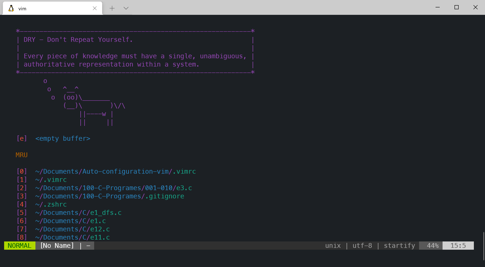
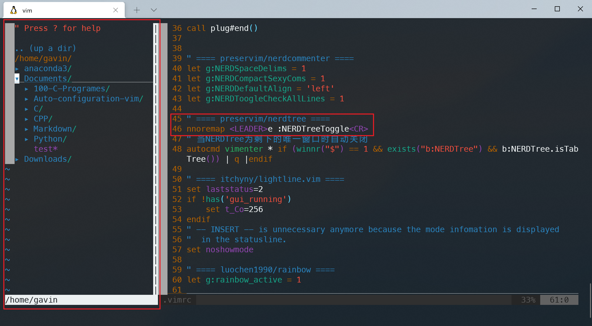
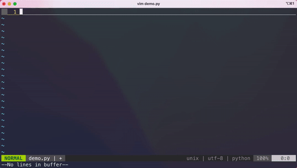
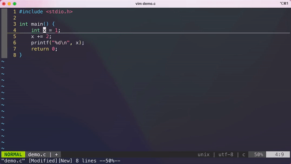
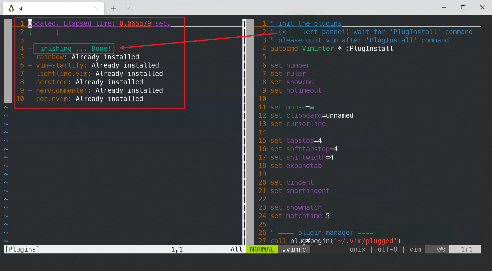

## 介绍

[](https://github.com/GavinSun0921/Auto-configuration-vim)
[](https://github.com/GavinSun0921/Auto-configuration-vim)
[](Auto-configuration-vim)

自动化配置 `vim` 的个人开发环境，包括基础的编辑器设置以及各种插件的安装与配置（包括LSP）。极大的便捷了配置过程。

### 内容/插件

0. [junegunn/vim-plug: Minimalist Vim Plugin Manager (github.com)](https://github.com/junegunn/vim-plug)

1. [itchyny/lightline.vim: A light and configurable statusline/tabline plugin for Vim (github.com)](https://github.com/itchyny/lightline.vim)

2. [preservim/nerdtree: A tree explorer plugin for vim. (github.com)](https://github.com/preservim/nerdtree)

3. [luochen1990/rainbow: Rainbow Parentheses Improved, shorter code, no level limit, smooth and fast, powerful configuration. (github.com)](https://github.com/luochen1990/rainbow)

4. [mhinz/vim-startify: The fancy start screen for Vim. (github.com)](https://github.com/mhinz/vim-startify)

5. [preservim/nerdcommenter: Vim plugin for intensely nerdy commenting powers (github.com)](https://github.com/preservim/nerdcommenter)

6. [neoclide/coc.nvim: Nodejs extension host for vim & neovim, load extensions like VSCode and host language servers. (github.com)](https://github.com/neoclide/coc.nvim)

### 效果

##### 利用插件的效果可直接进入对应项目查看更多配置和效果

以下截图为`Ubuntu(WSL)`与`macOS`的实际运行截图

**#1. 更改开始界面**）利用 `vim-startify` 插件更改 `vim` 的开始界面，即当直接打开 `vim` 后不跟文件名时：



**#2. 一键编译/运行**）在编辑 `C/C++` 和 `Python` 代码时，配置了 `Ctrl + i` 自动编译并执行（其中 `C` 和 `C++` 分别调用 `gcc` 和 `g++` ）：

```
" C and C++ compiler:
autocmd FileType c nnoremap <buffer> <C-i> :w <RETURN> :!gcc % -o test -g && ./test <RETURN>
autocmd FileType cpp nnoremap <buffer> <C-i> :w <RETURN> :!g++ % -o test -g && ./test <RETURN>

" Python runner:
autocmd FileType python nnoremap <buffer> <C-i> :w <RETURN> :!python % <RETURN>
```

**#3. 更美观的状态栏**）利用 `lightline.vim` 插件更改状态栏，显示当前模式、文件、编码方式等：


**#4. 目录文件树支持**）利用 `nerdtree` 插件对目录文件树的支持

- 绑定快捷键`\e`（`\`为`leader`，使用方式先后顺序按下即可）可切换目录文件树的打开关闭状态：



**#5. 彩虹括号匹配**）利用 `rainbow` 插件实现不同层级括号不同颜色进行匹配。

**#6. 一键自动注释代码**）利用 `nerdcommenter` 插件实现一键注释

- `\cc`（其中 `\` 为 `leader` 键，使用方式先后顺序按下即可）即可实现注释。
- `\cu`（其中 `\` 为 `leader` 键，使用方式先后顺序按下即可）即可实现取消注释。
- `\c<space>`（其中 `\` 为 `leader` 键，使用方式先后顺序按下即可）即可实现切换注释状态（对未注释代码使用可将代码注释，对注释代码使用可将代码取消注释）。

**#7. 高亮光标悬停代码块**）可以将光标悬停在对应代码块以在全部代码中对该部分进行高亮显示，例如变量、函数等。

**#8. 符号匹配与代码提示/补全**）利用 `coc.nvim` 实现该功能：

- 当补全出现补全候选项时

  -  `TAB` 键为下一个补全候选项
  - `Shift + TAB` 组合键为上一个补全候选项
  - `Ctrl + Enter` 组合键为呼出候选菜单
  - `Enter` 键为确定当前补全候选项（当有候选项被选中时）

  

- 在普通模式下 `K` 键会新开前窗口打开光标对应位置代码的说明文档。

  

- 配置 `\rn`（其中 `\` 为 `leader` 键，使用方式先后顺序按下即可）为 **重命名** 操作，如在变量定义处对变量进行重命名即可同时更新本代码文件内所有该变量的变量名。

  

- 配置 `\f`（其中 `\` 为 `leader` 键，使用方式先后顺序按下即可）为 **格式化(format)选中代码** 操作，格式化的代码风格更多查看 `coc.nvim` 插件项目说明。

- 更多功能和配置详见 `coc.nvim` 插件项目说明。

## 使用方式

**注意：本项目自动配置会将原有的vim配置进行备份（~/.vimrc.bak）**

#### Unix

```bash
git clone https://github.com/GavinSun0921/Auto-configuration-vim.git
cd Auto-configuration-vim
sh init.sh
```

安装完成后退出 `vim` ，即配置完毕。


